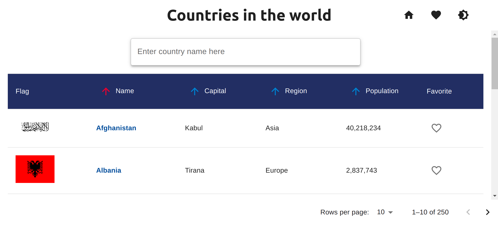

# Country Information App
This is a front-end project at [Integrify](https://www.integrify.io/). The website is build to find information about 250 countries in the world.

## How to run project
- clone project: `git clone git@github.com:ncongduy/country-information.git`
- In bash type: `npm install`
- Run project in dev environment, type in bash: `npm start`
- Build product environment, type in bash: `npm run build`

Navigate to http://localhost:3000/ in your browser for dev environment.

## Usage
User can scroll or type name of country on search box to find a country. When user click on a country, the website will show a specific information. In addition, the website has features which are sort information, switch theme and mark up favorite countries.

## The goal of project
This project help me to practice with:
- TypeScript
- React
- Redux
- Redux-Thunk
- React Router Dom 
- Material-UI

## Demo

## Deployment
https://country-information-app.netlify.app/

## Author
Code is created by Nguyen Cong Duy. I used starter code from [Integrify](https://www.integrify.io/)

## Sources
- [Integrify](https://www.integrify.io/)
- [React](https://reactjs.org/)
- [React Router Dom](https://reactrouter.com/docs/en/v6/getting-started/overview)
- [Redux](https://redux.js.org/)
- [TypeScript](https://www.typescriptlang.org/)
- [Material-UI](https://mui.com/)
- [Stackoverflow](https://stackoverflow.com/)
- [W3school](https://www.w3schools.com/)
- [MDN](https://developer.mozilla.org/en-US/)
